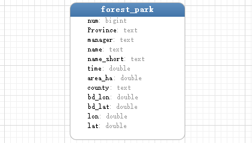

#  数据分析记录

#### 数据采集：

​    使用`Python` 的`requests`库进行网络数据爬取。最后存入`MySQL`数据库。

#### 数据清洗：

​    使用`JAVA` 的 `MapReduce`框架对采集数据进行清洗

#### 数据可视化：

​    后端使用`Python3.7`的`Flask`框架，返回数据统一为`JSON`对象。

​    前端可视化为 `ECharts`。

## 一、分析国家森林公园数据

主机地址：`192.168.23.102`

数据库端口：`6603`

数据库类型：`MySQL`

数据库名称：`data_data_analytics`

数据表：`forest_park`

数据表字段说明(共12个字段)：

| num    | Province | manager      | name | name_short | time     | area_ha        | county    | bd_lon | bd_lat | lon    | lat    |
| ------ | -------- | ------------ | ---- | ---------- | -------- | -------------- | --------- | ------ | ------ | ------ | ------ |
| 标号   | 省份     | 管理行政单位 | 名称 | 简称       | 创建时间 | 面积（万公顷） | 所在县/市 | bd经度 | bd纬度 | 经度   | 纬度   |
| bigint | text     | text         | text | text       | double   | double         | text      | double | double | double | double |

数据表结构图：

#### Part 1: 分析山东省所有的公园面积，通过柱状图展示

#### Part2: 分析山东省前5大小的公园，通过折线图展示

#### Part3: 分析一下各地区的最大森林公园，并用饼图展示

- 山东
- 福建
- 贵州
- 浙江
- 北京

## 二、分析各地区旅游景点2019上半年 数据

数据库字段说明：

| province | full_name | area             | number       | self_money       | state_money      | income       | expenditure  |
| :------: | --------- | ---------------- | ------------ | ---------------- | ---------------- | ------------ | ------------ |
|   省份   | 全名      | 面积（平方公里） | 人数（万人） | 建设成本（万元） | 国家资助（万元） | 收入（万元） | 支出（万元） |
|   text   | text      | text             | double       | double           | double           | double       | double       |

#### 要求：

- 每个图标横纵轴都要有单位、 图例组件(legend)
- 所有图标要有 tooltip,toolbox
- 折线图必须带有  坐标轴指示器（axisPointer )
- 大量数据情况必须要有 datazoom。

#### Part 1: 分析国家资助力度最大的20个景点，用折线图来展示

#### Part 2: 分析盈利最高的十个景点，并将盈利情况用饼图展示

#### Part 3: 使用一个柱状图展示所有景点的建设成本、国家资助、以及收支差。

#### Part 4: 分析所有的景点利润，用折线图表示 （利润=国家资助+收入-建设成本-支出）分段用不同颜色展示，参考(Beijing AQI)  利润在为负值用红色表示，利润在0~50万用橙色表示，利润在50~200万用黄色表示，利润在200万以上用绿色表示。

