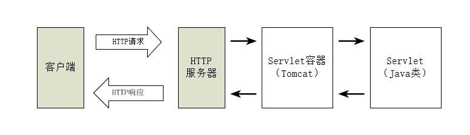
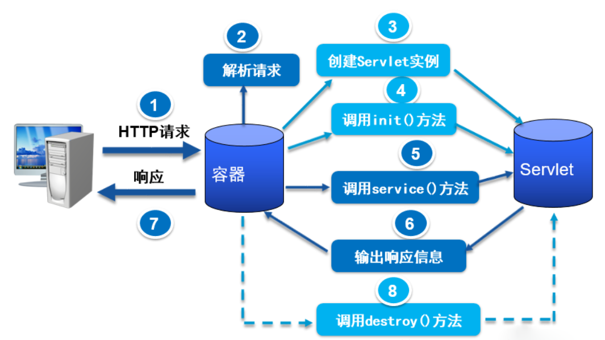

# 第3章、Servlet基础

## 3.1 Servlet 基础

​    Servlet 是使用 Java 语言编写的运行在`服务器端`的程序。狭义上的 Servlet 是指 Java 语言实现的一个接口，广义上的 Serlvet 是指任何实现了这个接口的类。一般情况下，理解为后者。

​    Servlet 主要作用：处理客户端传来的HTTP请求，并返回一个响应。常见处理请求的方法主要有 doGet() 和 doPost()。

​    Servlet 由 Servlet容器提供。例如：Tomcat，Servlet容器将 Servlet 动态地加载到服务器上。因此，Servlet容器能力比 Servlet 等大，他能接收所有的 HTTP 请求和响应。

​    Servlet 应用程序的体系结构为：



## 3.2 Servlet 开发入门

### 3.2.1 Servlet 接口及其实现类

- javax.servlet.Servlet: 底层接口

  针对底层接口 Servlet ，SUN公司提供了两个默认的接口实现类：

  1. GenericServlet 抽象类，该类为 Servlet 接口提供了部分实现，但是并没有实现 HTTP 请求处理。GenericServlet类中实现了Servelt接口的方法，留出了 service() 方法没有实现，需要我们自己去实现，因为此方法主要用于响应用户的请求。

  2. HttpServlet 是上面GenericServlet的子类，继承了 GenericServlet 的所有方法。重要的是为 HTTP请求中的 POST,GET 等类型提供了具体的操作方法。常用方法有：

     doGet,doPost,doPut 等

     实际开发中，通常只继承 HttpServlet。

###  3.2.2 实现第一个 Servlet程序

​    主要注意：

- 需要导入 Servlet 的 JAR 包。（servlet-api.jar）

- 项目目录下，应该创建有 `WEB-INF` 目录，并在此文件夹下，编写配置文件 `web.xml`（此配置文件示例在 Tomcat 示例应用下可见）。一个简单示例配置如下：

  ``` xml
  <?xml version="1.0" encoding="UTF-8"?>
  <web-app xmlns="http://xmlns.jcp.org/xml/ns/javaee"
    xmlns:xsi="http://www.w3.org/2001/XMLSchema-instance"
    xsi:schemaLocation="http://xmlns.jcp.org/xml/ns/javaee
                        http://xmlns.jcp.org/xml/ns/javaee/web-app_4_0.xsd"
    version="4.0"
    metadata-complete="true">
      <!-- 注册 Servlet -->
      <servlet>
        <servlet-name>HelloServlet</servlet-name> <!-- Servlet 名称 -->
        <servlet-class>top.skyzc.web.HelloServlet</servlet-class> <!-- Servlet 完整类名-->
      </servlet>
      <!-- 映射 Servlet 对外访问虚拟路径 一个 Servlet 可有多个 <servlet-mapping> 实现多重映射 -->
      <servlet-mapping>
        <servlet-name>HelloServlet</servlet-name> <!-- Servlet 名称 必须和上面相应的名称一样-->
        <url-pattern>/hello</url-pattern> <!-- 指定访问该 Servlet 的虚拟路径 以正斜线(/)开头 -->
        <!-- 当路径仅为 (/) 时，表示此 Servlet 就是当前 WEB应用的缺省 Servlet。如果当某个请求找不到匹配的虚拟路径时，该请求就会由缺省 Servlet 来处理。也就是说，缺省 Servlet 用来处理别的 Servlet 都不处理的访问请求 -->
      </servlet-mapping>
  </web-app>
  ```
- Tomcat 安装目录下也有一个缺省 Servlet (DefaultServlet) 。如果自己不设置缺省 Servlet 的话，他对容器内所有的 WEB应用都起作用。当调用某个静态 HTML 文件时，DefaultServlet 会判断该HTML是否存在。存在就以数据流的方式返回，不存在就返回 404 错误。

### 3.2.3 Servlet 的生命周期

​    在Java中任何对象都有生命周期。

​    Servlet 生命周期如下：
​    

可大致分为三个阶段：

- 初始化阶段

  主要涉及 init() 方法来实现Servlet的初始化工作。在一个 Servlet 的生命周期内， init() 方法只会执行一次。

- 运行阶段

  这是最重要的一个阶段。Servlet容器（Tomcat）会为这个请求创建代表 HTTP 请求的 `ServletRequest` 对象,和代表 HTTP 响应的 `ServletResponse`对象，然后将它们俩作为参数传递给 Servlet 的 service() 方法。

  service() 方法从 `ServletRequest` 对象中获取请求信息并处理该请求，通过 `ServletResponse`对象生成响应结果。

  每一次访问 Servlet容器（Tomcat）都会调用一次 service() 方法。

- 销毁阶段

  当服务器关闭或 Web应用被移除容器时，Servlet也会随着Web容器的销毁而销毁。在销毁之前会调用 destroy() 方法。在一个 Servlet 的生命周期内，destroy() 方法只会执行一次

### 3.2.4 配置某个 Servlet 自动加载

​    在 `web.xml`里，`<servlet>` 下可以使用 `<load-on-startup>`标签指定某个 Servlet 的加载顺序。

​    \<load-on-startup> 的值越小越先加载。如果等于 0 则表示 Servlet 容器将在 WEB 应用启动时加载并初始化该 Servlet。

``` xml
<?xml version="1.0" encoding="UTF-8"?>
<web-app xmlns="http://xmlns.jcp.org/xml/ns/javaee"
  xmlns:xsi="http://www.w3.org/2001/XMLSchema-instance"
  xsi:schemaLocation="http://xmlns.jcp.org/xml/ns/javaee
                      http://xmlns.jcp.org/xml/ns/javaee/web-app_4_0.xsd"
  version="4.0"
  metadata-complete="true">
    <servlet>
      <servlet-name>HelloServlet</servlet-name>
      <servlet-class>top.skyzc.web.HelloServlet</servlet-class> 
      <!-- 配置 Servlet 加载顺序 -->
        <load-on-startup>0</load-on-startup>
    </servlet>
    <servlet-mapping>
      <servlet-name>HelloServlet</servlet-name> 
      <url-pattern>/hello</url-pattern>
    </servlet-mapping>
</web-app>
```

## 3.3 ServletConfig 和 ServletContext

TODO:

# 第四章、请求和响应

​    本章主要介绍 `HttpServletReques` , `HttpServletResponse` 以及 `RequestDispatcher` 对象

## 4.1 HttpServletResponse 对象

### 4.1.1 发送状态码相关的方法

1. setStatus(int status) 方法
2. sendError(int sc) 方法

### 4.1.2 发送响应头相关方法

### 4.1.3 发送响应体相关方法

1. getOutputStream() 方法
2. getWriter() 方法

## 4.2 HttpServletResponse 应用

【任务4-1】解决中文输出乱码问题

【任务4-2】实现网页定时刷新并跳转

## 4.3 HttpServletRequest 对象

### 4.3.1 获取请求行信息的相关方法

### 4.3.2 获取请求头信息的相关方法

#### 动手体验：利用 Referer 请求头防止“盗链”

## 4.4 HttpServletRequest 应用

### 4.4.1 获取请求参数

【任务4-3】解决请求参数的中文乱码问题

## 4.5 RequestDispatcher 对象的应用

### 4.5.1 RequestDispatcher 接口

### 4.5.2 请求转发

### 4.5.3 请求包含


# 第五章、会话及其会话技术

​    本章主要介绍 `cookie` 以及 `session`。

# 第六章、JSP 技术

​    JSP (Java Server Pages)。

## 6.1 JSP 概述

## 6.2 JSP 基本语法

### 6.2.1 JSP 脚本元素

1. JSP Scriptlets
2. JSP 声明语句
3. JSP 表达式

### 6.2.2 JSP 注释

``` java
<% 内容 %>
```

JSP 注释在JSP被编译成 Servlet 时会被自动忽略，不会将注释信息发送到客户端。

## 6.3 JSP 指令

### 6.3.1 page指令

page 指令一般存在与 JSP 页面的开始。（page 指令对整个页面都有效，与位置无关）

### 6.3.2 include 指令

在实际开发中，有时候需要静态包含一个文件（HTML、JSP、文本文件等）即使用此指令

常用的是抽取页面公共部分时，就可以用此指令实现

``` java
<%@ include file="包含文件的相对地址"%>
```

include 指令只有`一个 file 属性`

file 属性值使用`相对路径`。

## 6.4 JSP 隐式对象

### 6.4.1 隐式对象概述

有的对象平时经常用到，没必要每次重复常见。JSP2.0 规范之后便提供了9个常见的对象，在开发中可以直接使用。

TODO:

### 6.4.2 out

### 6.4.3 pageContext

### 6.4.4 exception

## 6.5 JSP 动作元素

### 6.5.1 \<jsp:include> 动作元素

### 6.5.2 \<jsp:forward> 动作元素


# 第七章、EL 表达式和 JSTL

## 7.1 认识 JavaBean 

### 7.1.1 什么是Java Bean

### 7.1.2 访问 JavaBean 的属性

### 7.1.3 BeanUtils 工具

## 7.2 EL 表达式

### 7.2.1 初始 EL

EL 可以简化 JSP 页面的书写。

EL 语法形式：

``` java
${ 表达式 }
```

### 7.2.2 EL 中的标识符

EL 标识符规范：

- 不能以数字开头。
- 不能是 EL 中的保留字，如 and,or,gt。
- 不能是 EL 隐式对象，如 pageContext。
- 不能包含 (') ("") (-) (/) 等特殊字符。

### 7.2.3 EL 保留字

### 7.2.4 EL 中的变量

### 7.2.5 EL 中的常量

TODO: 字符串常量转义

### 7.2.6 EL 中的运算符

### 7.2.7 EL 隐式对象

## 7.3 JSTL

### 7.3.1 JSTL 概述

标准标签库，简称 JSTL (JavaServer Pages Standard Tag Library)。

JSTL 由 5 个不同功能的标签库共同组成。5 个标签库都分别指定了不同的 URI 以及建议的前缀。

### 7.3.2 JSTL 的使用

### 7.3.3 JSTL 中的 Core 标签库

Core 标签库是 JSTL 中的核心标签库，包含了 Web应用中通用操作标签。

# 第八章、Servlet 高级

## 8.1 Filter 过滤器

## 8.2 Listener 监听器--Servlet 事件监听器概述


# 第九章、JDBC

# 第十章、数据库连接池与 DBUtils 工具

# 第十二章、文件的上传和下载

