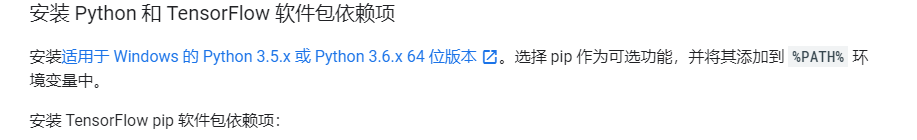
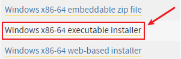
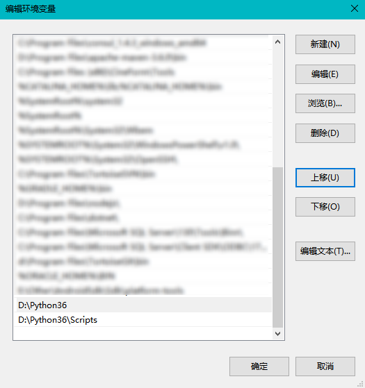

# 选择Python版本及安装Python3.6.5



下载了Python3.6.5 可执行安装程序：



自定义安装后，配置环境，把Python的`安装目录`以及`安装目录下的Scripts/`加入系统 path环境变量下：



> 这里记录一下Windows下快速打开系统属性的快捷键：`WIN+PAUSE BREAK`
>
> ​	   											     快速打开系统任务管理器：`CTRL+SHIFT+ESC`

安装好后就可以在命令行输入Python了，这里我们还要更新一下pip:(管理员身份运行CMD)

```bash
python -m pip install --upgrade pip --force-reinstall
```

