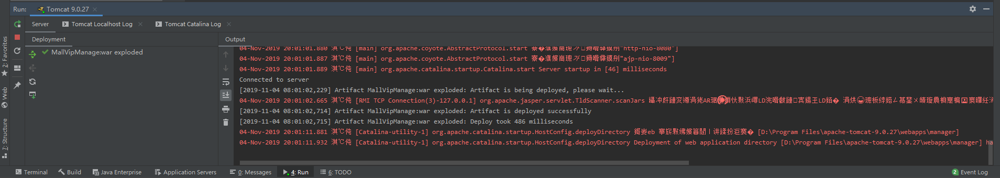
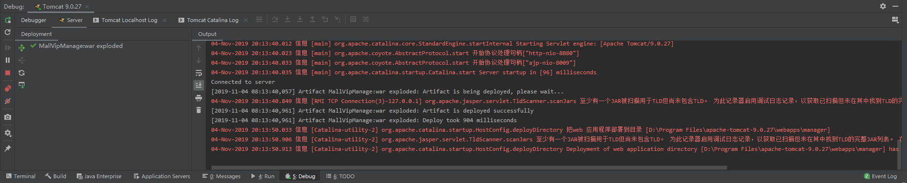

启动 Tomcat 9后，控制台一堆乱码，严重影响了信息的查看：



首先想到应该是Tomcat的编码问题，于是查询资料后找到了问题所在。只需要修改 Tomcat的控制台编码即可。

进入 Tomcat 安装目录，找到 `/conf/logging.properties`

然后找到

```bash
java.util.logging.ConsoleHandler.encoding = UTF-8
```

将这个值改为 `GBK` 即可（或者将此行注释掉也能修复乱码）：

```bash
java.util.logging.ConsoleHandler.encoding = GBK
```

效果：



