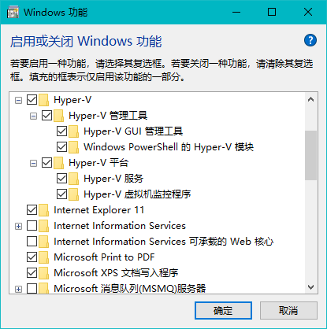
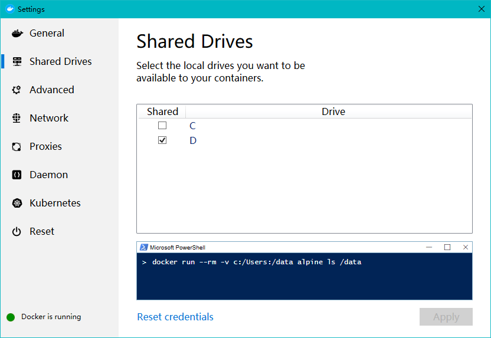
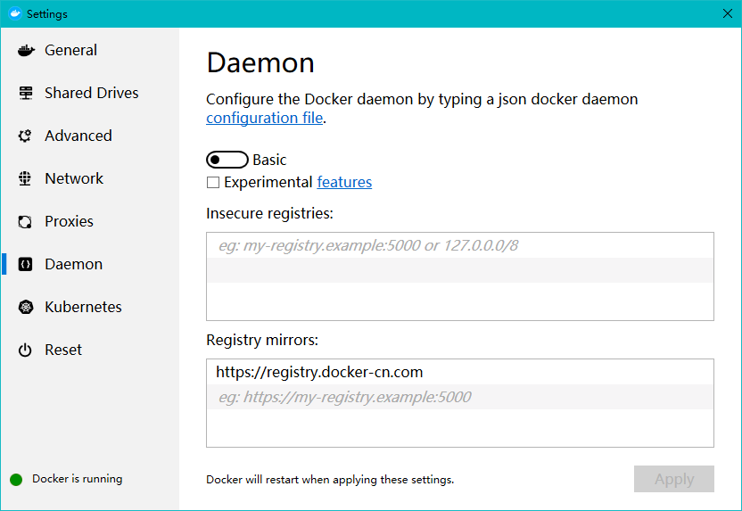
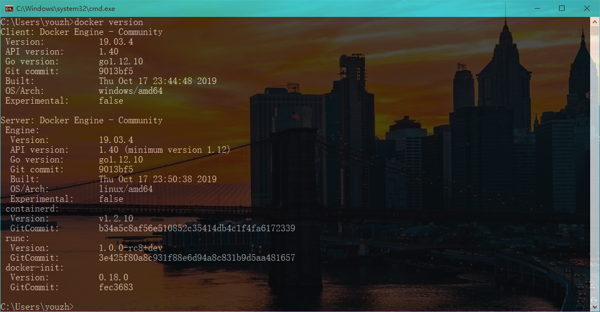
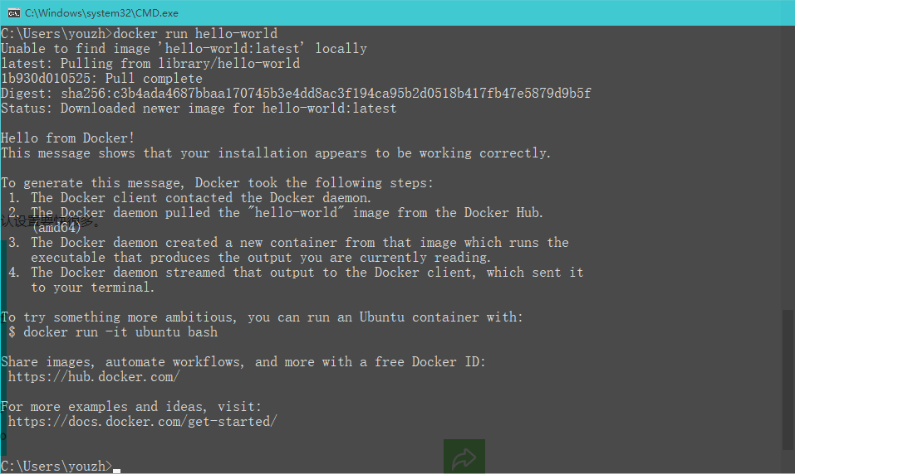
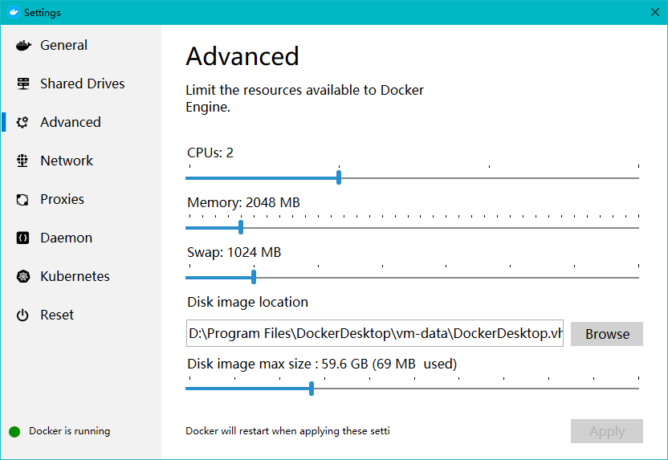

一、安装信息

​           Windows 10

​           Docker Version 19.03.4

​           Docker Desktop 2.1

### 二、安装过程

####          1. 启用Hyper-V

​            在Windows功能管理中，启用 `Hyper-V` 平台的支持。（可直接使用 Win+Q打开搜索，输入“启用和关闭 Windows 功能” 直接进入）



#### 2.安装 Docker：

​             直接点击我们下载的Docker安装文件进行安装。安装成功如图：


​            重启后，可见：（推荐不勾选第二项）


配置共享磁盘 Shared Drives



配置 Deamon



打开命令行，查看docker版本：



测试



### 检查加速器是否生效

检查加速器是否生效配置加速器之后，如果拉取镜像仍然十分缓慢，请手动检查加速器配置是否生效，在命令行执行 **docker info**，如果从结果中看到了如下内容，说明配置成功。

```bash
$ docker info
Registry Mirrors:
    https://registry.docker-cn.com/
```

# [Win10 Docker修改镜像存储位置](https://www.cnblogs.com/bchen/p/7691165.html)

修改镜像位置

