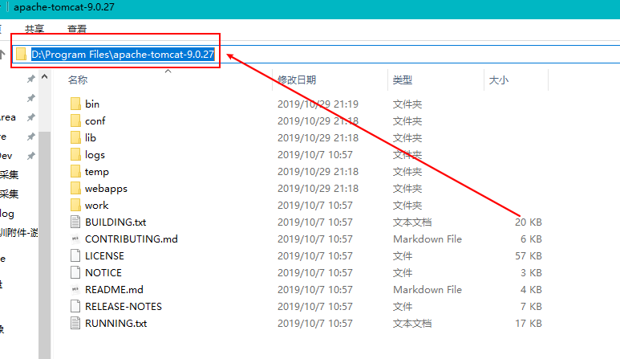
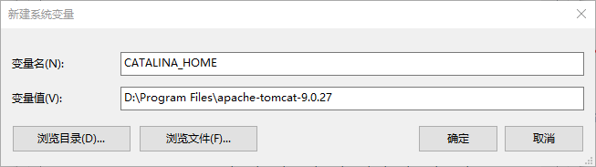
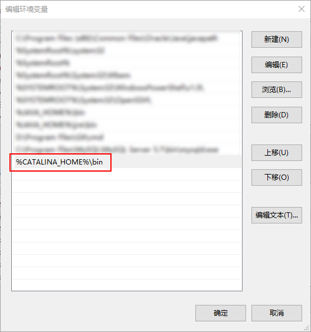
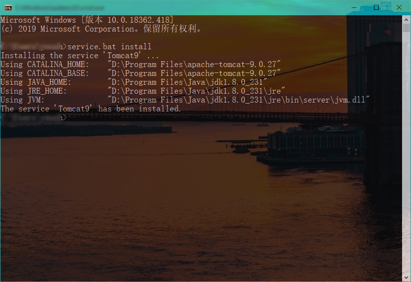
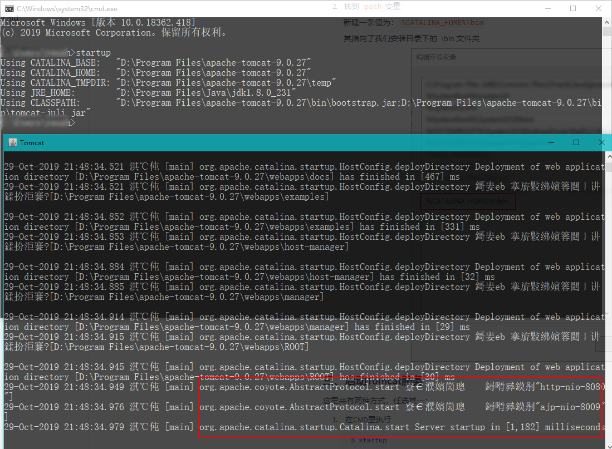
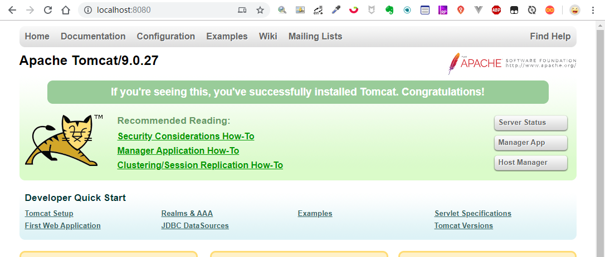

### 一、准备

已安装Java并且配置了环境变量

Tomcat9：[官网下载]( https://tomcat.apache.org/download-90.cgi )

###  二、开始安装

#### 2.1 解压包

将下载的 Tomcat 压缩包解压，移动至某个文件夹（此处为 `D:\Program Files`），然后进入我们解压后的文件夹，此时复制其路径：（`D:\Program Files\apache-tomcat-9.0.27`）


#### 2.2 配置环境变量

打开系统环境变量设置，新建系统变量

1. 变量名： `CATALINA_HOME` 

​           变量值：`D:\Program Files\apache-tomcat-9.0.27`



2. 找到 `path`变量

   新建一条值为：`%CATALINA_HOME%\bin`

   其指向了我们安装目录下的  \bin 文件夹

   

   

   将 Tomcat 服务安装进系统

   在环境变量设置成功后，在CMD输入

   ```bash
   $ service.bat install
   ```

   如下图，提示安装成功：

   

### 三、启动Tomcat服务

这里共有两种方式，任选其一：

1.  方法一：在CMD里执行 (不推荐)

   ```bash
   $ startup
   ```

   

此时不要关闭此CMD窗口，打开浏览器输入地址： [localhost:8080]( http://localhost:8080/ ) 即可访问Tomcat主页（Tomcat默认运行端口为8080）

如果关闭此窗口，即停止Tomcat服务，所以这种方法不推荐。

2. 方法二： 

   （ 此方法需保证已经将 Tomcat 的 Service 安装进系统 ）

   右键点击桌面上的

   > “此电脑”->“管理”->“服务和应用程序”->“服务”，找到“Apache Tomcat”服务，右键点击该服务，选择“属性”，将“启动类型”由“手动”改成“自动”

   这样我们的Tomcat就会一直在系统后台运行了，重启后也会一直运行。我们随时打开[localhost:8080]( http://localhost:8080/) 进入Tomcat主页。

   